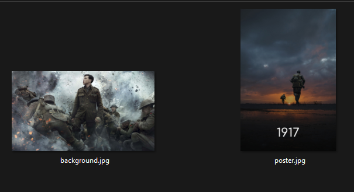
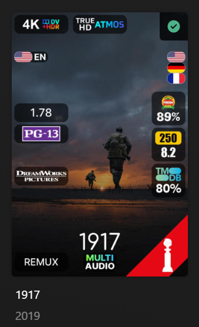
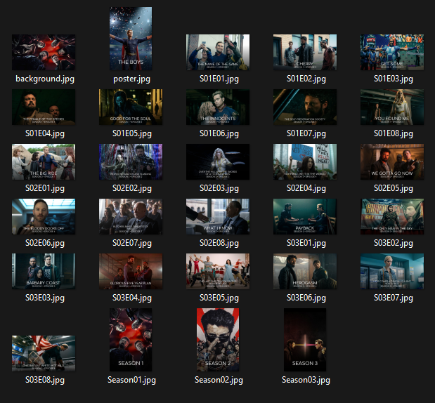
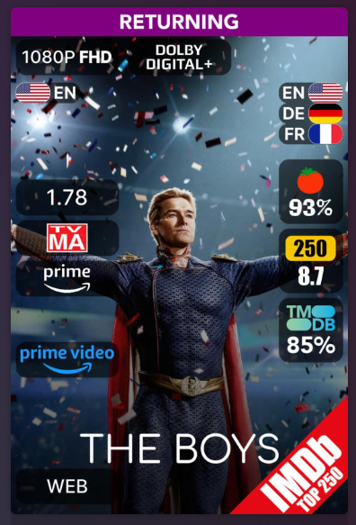

# bullmoose20 PMM files
## Basics
I run PMM nightly (not lsio image) and Plex(hotio image) on Unraid 6.12.6. At the top of my config.yml file I will usually specify the version that this config.yml file works with.

## Instructions
Take what you need from my config.yml. I run everything stock from the github default PMM and tweak from within my config.yml to "make it my own". If you perform a straight copy, search for `(redacted)` as you will need to replace that with your own information. Search for `db_cache` which is for Plex and now available to set via PMM. I use 2048 MB (2GB) as my system has 168 GB of RAM. You will want to improve it from the default 40 MB that Plex sets. Maybe a good starting point if you have enough RAM is 1024 MB which is 1GB.

If you want to set the language file to something other than fr (french) do not forget to make that change to `language: fr` lines in the config.yml file before running. As for the `placeholder_imdb_id:` ensure that you read and understand those lines as you may need to choose your own **Movie** or **TV Show** as your library may not have the two references that I have.

Nothing is local other than the fonts which are included in this repo (fonts.zip). These fonts are the best match I could find per ratings site and the ratings overlays. 

Unzip the fonts into `config/metadata/overlays/fonts/` to use this config without modifications.

You can put the fonts elsewhere, but if you choose to do that, you will need to adjust the ratings section (rating1_font:, rating2_font:, rating3_font:) of the overlays within the config.yml file to point to the location you chose.

## Assets

I also prefer to have a copy of the local assets so that if I need to recover to the original posters, they are there. I use PlexPosterMaker.ps1 from FSCorrupt's repo to help with that: https://github.com/fscorrupt/Plex-Poster-Maker . I also use PMM's assets in a folder structure as described in the wiki here: https://metamanager.wiki/en/latest/pmm/guides/assets/

Essentially, I prefer `tmdb` as a source and textless images all around with a fallback to English and then German(`["xx", "en", "de"]`). Then I apply a gradient of my choice (`bottom-up-fade.png` & `bottom-up-fade-background.png`), and font of my choice (`Comfortaa-Medium.ttf`) which happens to match the PMM defaults for Collections. The secrets to all of this are found in the `bullmoose20config.json` file found in the ppm subdirectory along with the font and the gradient files.

Unraid Docker-Compose file is also shared and when prompted in Unraid to add a UI Label Icon, use this link: https://raw.githubusercontent.com/fscorrupt/Plex-Poster-Maker/main/images/webhook.png

After PPM applies my settings Movie example

After PMM applies overlays to Movie example

After PPM applies my settings Show example

After PMM applies overlays to Show example

 

Feel free to ask me questions in the PMM Discord channel.

 
